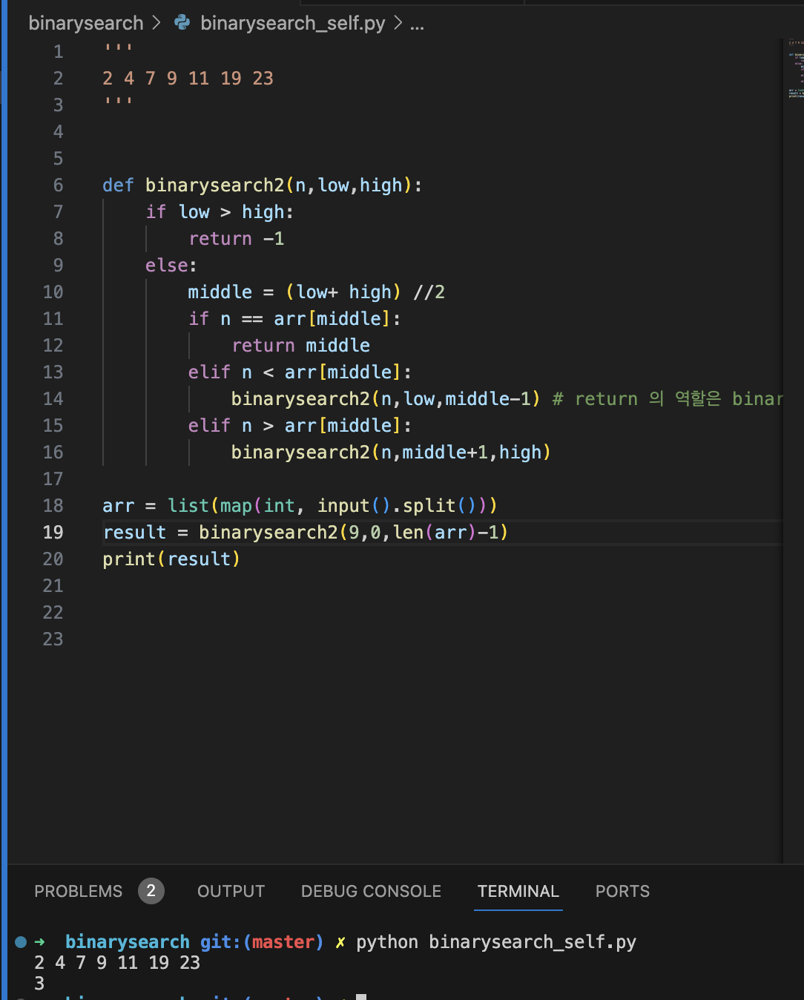
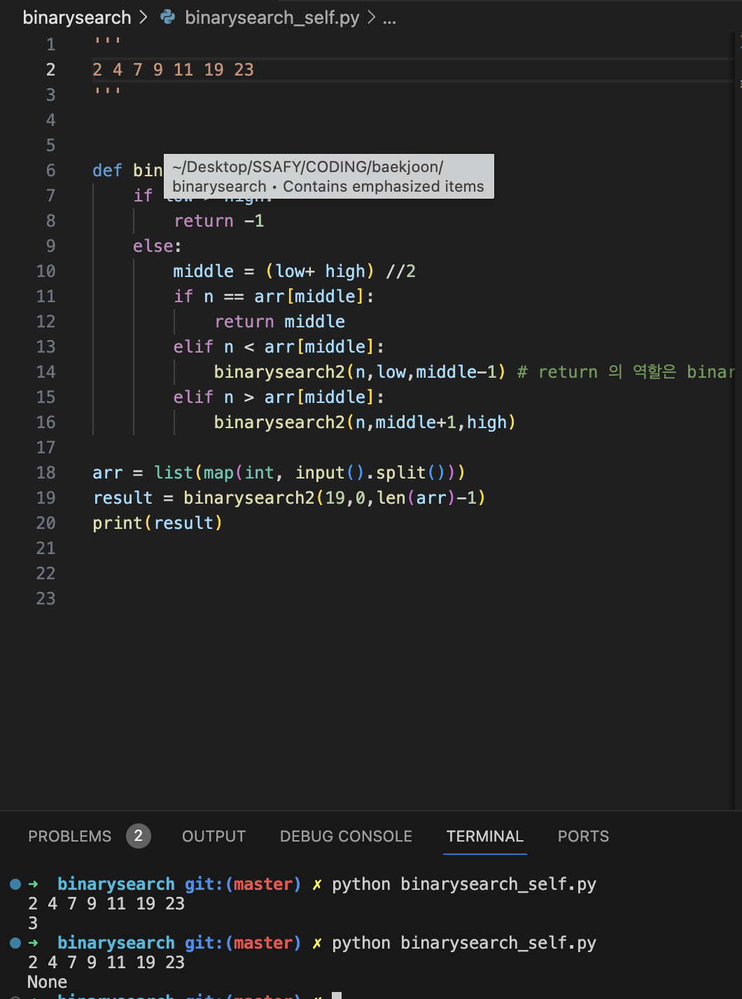

# 재귀함수에서의 return 고찰


```python
def binarysearch2(n,low,high):
    if low > high:
        return -1
    else:
        middle = (low+ high) //2
        if n == arr[middle]:
            return middle
        elif n < arr[middle]:
            return binarysearch2(n,low,middle-1) 
        elif n > arr[middle]:
            return binarysearch2(n,middle+1,high)

```
이 코드는 return 에 대한 것이 존재. 재귀 함수가 콜스택에 쌓여가며 함수를 호출한다. 결과적으로 if 문이 실행되고 return middle 하였을 때, 맨 위 스택에 middle 값이 return 되고 콜스택 아래에 있는 함수에 전달.

-> 그 함수는 하위 함수로부터 받은 return 값을 그대로 반환 
연쇄적으로 반환되어 처음 들어있는 콜스택에서의 재귀함수가 최종적으로 반환한다. (Middler값)


---
```python
def binarysearch2(n,low,high):
    if low > high:
        return -1
    else:
        middle = (low+ high) //2
        if n == arr[middle]:
            return middle
        elif n < arr[middle]:
            binarysearch2(n,low,middle-1) 
        elif n > arr[middle]:
            binarysearch2(n,middle+1,high)
```
이것은 return 문이 없다. 마지막 콜 스택에서의 함수가 middle값을 반환 할 지라도 그 다음으로 받는 것은 다음 상위 함수로의 Return 을 해주지 못하여 None 값을 반환하게 된다. 



사진 상에서 Return 이 없이 첫 번째 재귀 호출 때 If 문이 실행되도록 9를 탐색하는 코드를 호출 했을 때는 재귀가 처음부터 Return 이 들어가기 때문에 정상적으로 호출.


이 사진으로 보면 콜 스택에 재귀함수가 쌓이면서 상위 함수로 return값이 계속해서 반환될 수 없기에 None 값이 출력됨.
---